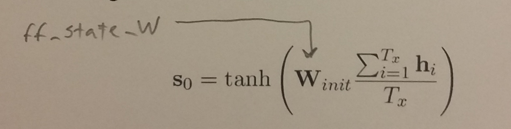
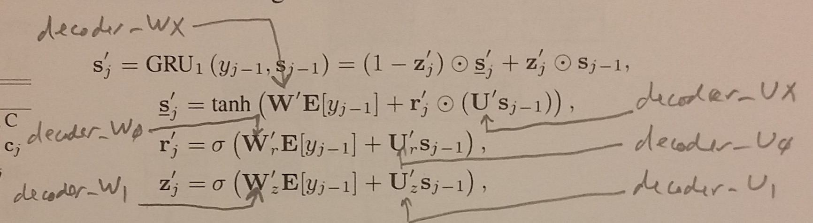
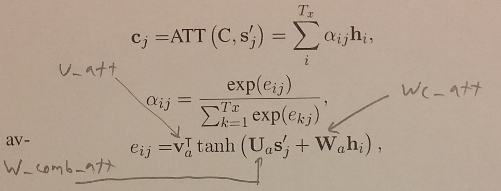
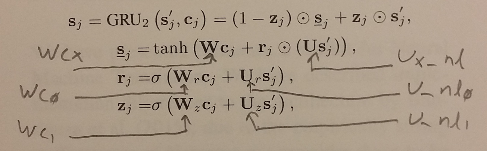
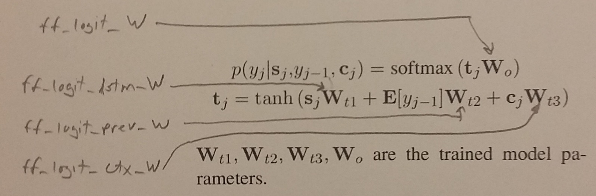

Notes on the Nematus architecture and code...

http://aclweb.org/anthology/E17-3017

In our tiny_sample:

```
VOCAB_SIZE = 90000
dim_word = 500
n_words = 90000
n_words_src = 90000
dim = 1024
```

----

In the [GRU math](https://en.wikipedia.org/wiki/Gated_recurrent_unit)
each unit has a reset gate (r) and an update gate (z).  Each gate is
governed by two weight matrices and bias vector.  There's also a
proposed state which is governed by two weight matrices and a bias
vector.  There are therefore a total of 6 weight matrices and 3 bias
vectors for each GRU.

The code concatenates the Wr and Wz matrices into one W matrix.  It
does similar for Ur and Uz into U and bz, br into b.  So we end up
with 6 named parameters per GRU in the code: 4 weight matrices and 2
bias vectors.

The equations in the paper omit biases but they are shown in the named
parameters above.

----

One way to add paragraph vectors is by extending the h vectors.
There's one h vector for each source word.  Each h vector is the
concatenation of the forward and backward encoder hidden states at
each timestep.  Each GRU has 1024 units, so each has dimension 2048.
Extending by paragraph vectors of length 500 means h' would have
dimension 2548.

In the decoder, each c vector is a linear combination of the h
vectors, so c must also now have dimension 2548.  Any weight matrices
in the decoder that directly touch h or c must therefore be extended
as well, but note that we maintain length 1024 for the decoder hidden
state.

Below, the proposed new dimensions are shown following 'pv -->'.  It
looks like 8 weight matrices must be updated.

----

```
embedding
  Wemb                       (90000, 500)           source word embeddings
  Wemb_dec                   (90000. 500)           target word embeddings (in decoder)
```

```
encoder: bidirectional RNN
  forward RNN
    encoder_W                (500, 2048)            encoder equations not in paper
    encoder_b                (2048, )
    encoder_U                (1024, 2048)
    encoder_Wx               (500, 1024)
    encoder_bx               (1024, )
    encoder_Ux               (1024, 1024)

  reverse RNN
    encoder_r_W              (500, 2048)
    encoder_r_b              (2048,)
    encoder_r_U              (1024, 2048)
    encoder_r_Wx             (500, 1024)
    encoder_r_bx             (1024, )
    encoder_r_Ux             (1024, 1024)
```

```
init_state, init_cell
  ff_state_W                 (2048, 1024)           Winit      pv --> (2548, 1024)
  ff_state_b                 (1024, )
```



```
decoder
  GRU1
    decoder_W                (500, 2048)            W'r W'z
    decoder_b                (2048, )               (combined biases for reset and update gates)
    decoder_U                (1024, 2048)           U'r U'z
    decoder_Wx               (500, 1024)            W'
    decoder_Ux               (1024, 1024)           U'
    decoder_bx               (1024, )
```



```
  attention
    decoder_W_comb_att       (1024, 2048)           Ua         pv --> (1024, 2548)
    decoder_Wc_att           (2048, 2048)           Wa         pv --> (2548, 2548)
    decoder_b_att            (2048, )                          pv --> (2548, )
    decoder_U_att            (2048, 1)              va         pv --> (2548, 1)
    decoder_c_tt             (1, )                  (not in paper, like a bias?)
```



```
  GRU2
    decoder_U_nl             (1024, 2048)           Ur Uz
    decoder_b_nl             (2048, )               (combined biases for reset and update gates)
    decoder_Ux_nl            (1024, 1024)           U
    decoder_bx_nl            (1024, )
    decoder_Wc               (2048, 2048)           Wr Wz      pv --> (2548, 2048)
    decoder_Wcx              (2048, 1024)           W          pv --> (2548, 1024)
```




```
readout
  from GRU2
    ff_logit_lstm_W          (1024, 500)            Wt1
    ff_logit_lstm_b          (500, )
  prev word
    ff_logit_prev_W          (500, 500)             Wt2
    ff_logit_prev_b          (500, )
  context
    ff_logit_ctx_W           (2048, 500)            Wt3        pv --> (2548, 500)
    ff_logit_ctx_b           (500, )
  output 1-of-k
    ff_logit_W               (500, 90000)           Wo
    ff_logit_b               (90000, )
```


